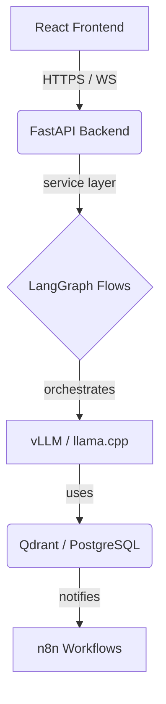

# Argos: AI-Integrated Knowledge & Execution Engine

Argos is a single-user, power-user–oriented system that turns fragmented notes, chat logs, repositories, and research into a coherent execution engine. It combines a cyberpunk-inspired dashboard with advanced agentic workflows powered by LangGraph.

## 🚀 Overview

Argos is designed for determinism, observability, and separation of concerns. It doesn't just "chat" with your data; it builds a structured knowledge graph and executes complex tasks through specialized "model lanes."

- **Frontend**: React + TypeScript cyberpunk dashboard (glassmorphism, neon, node/graph UIs).
- **Backend**: FastAPI + Python 3.11 with Pydantic-typed REST and streaming endpoints.
- **Orchestration**: LangGraph for deterministic agent flows; n8n for side-band automations.
- **Runtimes**: vLLM / llama.cpp / custom PyTorch (ROCm) for inference.
- **Storage**: Qdrant (vector search), PostgreSQL (metadata/state), and SQLite (local dev).

---

## 🛠 Repository Structure

```text
argos/
├── backend/            # FastAPI application logic & services
├── frontend/           # React + Vite dashboard
├── docs/               # Technical specs and research reports
├── scripts/            # Management, deployment, and test scripts
├── data/               # Local database and state (ignored by git)
├── e2e/                # Playwright end-to-end tests
├── nix/                # Nix environment definitions
├── ops/                # Docker, Caddy, and infrastructure configs
└── tools/              # Helper utilities and CI tools
```

---

## 🚦 Getting Started

### Prerequisites
- **Python 3.11+**
- **Node.js 20+** (pnpm recommended)
- **Docker & Docker Compose**
- **Nix** (Optional, but recommended for reproducible environments)

### Quick Setup (Local Dev)

1. **Environment Setup**:
   ```bash
   cp .env.example .env
   # Edit .env with your local settings
   ```

2. **Backend**:
   ```bash
   cd backend
   poetry install
   poetry run uvicorn app.main:app --reload
   ```

3. **Frontend**:
   ```bash
   cd frontend
   pnpm install
   pnpm dev
   ```

4. **Services (Qdrant/Postgres)**:
   ```bash
   docker compose -f ops/docker-compose.yml up -d qdrant postgres
   ```

---

## 🧪 Testing

- **Backend**: `cd backend && pytest`
- **End-to-End**: `pnpm e2e` (Runs Playwright tests via `scripts/run_e2e_nix.sh`)
- **Smoke Tests**: `sh scripts/simple_test.sh`

---

## 🛡 Security & Hardening

Argos is built with a "Security First" mindset:
- **API Authentication**: JWT-based auth with short-lived access tokens.
- **Sandboxing**: Agent execution is isolated from the host system.
- **Data Privacy**: Local inference support via `llama.cpp` and `vLLM`.
- **Secret Management**: Environment-variable based configuration (never hardcoded).

---

## 📈 Architecture & Data Flow



For a deep dive into the system architecture, see [docs/CORTEX_DEEP_DIVE_ANALYSIS.md](docs/CORTEX_DEEP_DIVE_ANALYSIS.md).

---

## 📝 License

See the [LICENSE](LICENSE) file for details. (Coming soon)